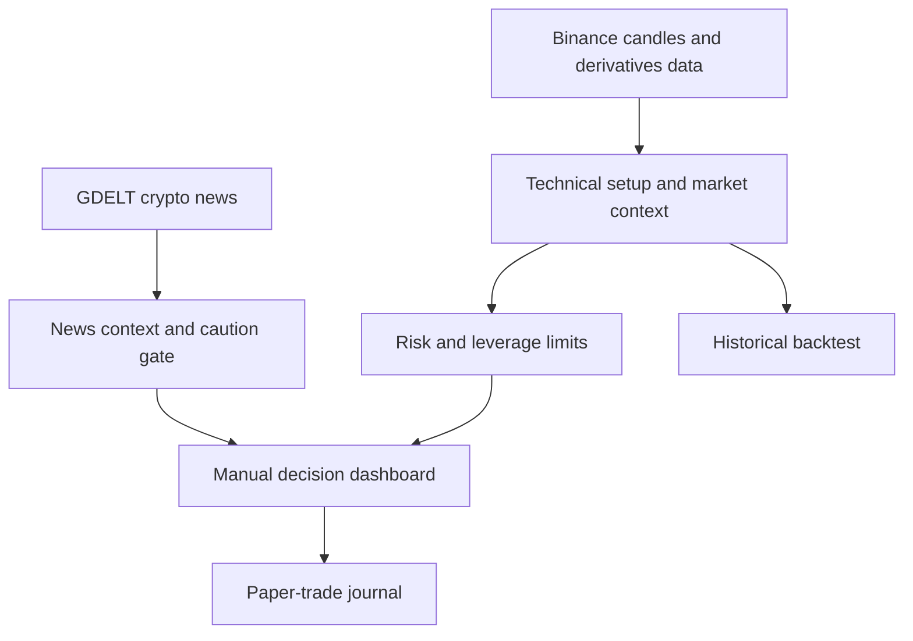

# Step-by-Step Build Guide: BTC & ETH Binance Trading Assistant

**Version 3 — technical signals, market trends and news context**

## 1. What you are building

This project is a continuously monitoring, manual-decision application for a maximum starting capital of **$100**. It analyzes BTC/USDT and ETH/USDT using completed one-hour candles and supports:

- Spot: long positions only;
- Isolated Margin: long and short analysis;
- USDⓈ-M Futures: long and short analysis;
- 2× to 5× leverage in leveraged modes;
- LONG SETUP, SHORT SETUP, NEUTRAL / WAIT and EXIT / AVOID decisions;
- entry range, stop-loss, target, quantity, collateral and market-exposure calculations;
- continuous price monitoring with 1-hour, 4-hour and daily trend context;
- 24-hour price/volume statistics plus Futures funding and open interest;
- recent crypto-news headlines with transparent sentiment and risk flags;
- historical testing and a paper-trading journal.

It does not place orders and does not guarantee profit. The current “model” is a transparent rules engine rather than a trained neural network. This is intentional: every decision can be inspected before real funds are involved.

## 2. How the system works



The most important design rule is separation:

1. **Market data** says what happened in price, volume, funding and open interest.
2. **Indicators** summarize trend, momentum, volume and volatility.
3. **Signal rules** decide whether a technical setup qualifies.
4. **Market context** checks higher timeframes and possible direction conflicts.
5. **News context** highlights headline tone and high-impact event risk without creating a trade.
6. **Risk rules** decide whether the setup is affordable within the $100 ceiling.
7. **The user** decides whether to place a manual order.

## 3. Install the development tools on Windows

Use Python 3.11 because it has broad support across Streamlit, pandas, NumPy and deployment services.

### Step 3.1 — Verify Python 3.11

Open **Command Prompt**, not PowerShell:

```cmd
py -0p
```

You should see Python 3.11 in the list. Verify it directly:

```cmd
py -3.11 --version
```

Example output:

```text
Python 3.11.x
```

### Step 3.2 — Create the project folder

```cmd
mkdir Binance-Trading-Assistant
cd Binance-Trading-Assistant
```

Open this folder in VS Code:

```cmd
code .
```

If `code` is not recognized, open VS Code manually and select **File > Open Folder**.

### Step 3.3 — Create and activate a virtual environment

```cmd
py -3.11 -m venv .venv
.venv\Scripts\activate
```

After activation, the command line should begin with `(.venv)`.

### Step 3.4 — Install packages

Create `requirements.txt`:

```text
streamlit==1.44.1
streamlit-autorefresh==1.0.1
pandas==2.2.3
numpy==2.2.4
plotly==6.0.1
requests==2.32.3
```

Install them:

```cmd
python -m pip install --upgrade pip
pip install -r requirements.txt
```

## 4. Create the project structure

Create this structure in VS Code:

```text
Binance-Trading-Assistant/
├── app.py
├── requirements.txt
├── requirements-dev.txt
├── README.md
├── SECURITY.md
├── .gitignore
├── .python-version
├── .streamlit/
│   └── config.toml
├── docs/
│   └── STEP_BY_STEP_BUILD_GUIDE.md
├── src/
│   ├── __init__.py
│   ├── binance_client.py
│   ├── indicators.py
│   ├── signals.py
│   ├── risk.py
│   ├── backtest.py
│   ├── market_context.py
│   └── news.py
└── tests/
    ├── __init__.py
    ├── test_indicators.py
    ├── test_signals.py
    ├── test_risk.py
    ├── test_backtest.py
    ├── test_market_context.py
    └── test_news.py
```

Each module should have one responsibility. `binance_client.py` validates exchange data, `indicators.py` calculates technical features, `signals.py` scores setups, `risk.py` sizes positions, `backtest.py` evaluates historical rules, `market_context.py` combines timeframe and derivatives context, and `news.py` retrieves and scores headlines. Keep `app.py` focused on orchestration and display; mixing these calculations into the interface makes testing and future automation much harder.

### Step 4.1 — Choose the beginner-safe build method

The downloaded ZIP already contains every completed file. For a new developer, use it as the authoritative source instead of trying to combine partial snippets manually:

1. Right-click `BTC_ETH_Continuous_Monitoring_Assistant.zip` and select **Extract All**.
2. Open VS Code.
3. Select **File > Open Folder**.
4. Select the extracted `binance-btc-eth-assistant` folder.
5. In the left **Explorer**, expand `src`, `tests` and `docs`.
6. Never paste indicator, signal or risk calculations directly into `app.py`. Each calculation already has a dedicated file.

If you want to recreate the project manually, create the folders and blank files shown above. For each file, copy the **entire content** from the corresponding file in the extracted project, press `Ctrl+A` in your blank file, paste, and press `Ctrl+S`. This full-file method prevents indentation and placement errors.

### Step 4.2 — How to see line numbers in VS Code

1. Open a Python file in VS Code.
2. Line numbers should appear on the left of the editor.
3. If they do not, select **File > Preferences > Settings**.
4. Search for `line numbers`.
5. Set **Editor: Line Numbers** to `on`.
6. Press `Ctrl+G`, type a line number, and press `Enter` to jump directly to it.

Line numbers below refer to the supplied Version 3 files. They may move after you edit the code. The function name is the permanent search marker: press `Ctrl+F` and search for the listed function if a line number no longer matches.

### Step 4.3 — Exact code-placement map

| Build task | File to open | Version 3 lines | Stable search marker |
|---|---|---:|---|
| Binance live price and candles | `src/binance_client.py` | 23–89 | `def fetch_live_price` and `def fetch_closed_klines` |
| EMA, RSI, MACD, ATR and volume | `src/indicators.py` | 7–37 | `def add_indicators` |
| LONG/SHORT scoring | `src/signals.py` | 23–40 | `def add_signal_scores` |
| Final signal decision | `src/signals.py` | 43–87 | `def latest_signal` |
| $100 position sizing | `src/risk.py` | 25–71 | `def build_trade_plan` |
| Historical backtest | `src/backtest.py` | 24–101 | `def run_backtest` |
| 1h/4h/1d and derivatives context | `src/market_context.py` | 22–100 | `def classify_trend` and `def fetch_market_context` |
| News scoring and caution gate | `src/news.py` | 52–120 | `def score_headline` and `def fetch_crypto_news` |
| User controls and dashboard | `app.py` | 78–394 | `st.title` |
| Automated checks | `tests/` | complete files | Search for `def test_` |

### Step 4.4 — Verify that VS Code opened the correct folder

Open **Terminal > New Terminal**. Confirm that the prompt ends with the extracted project folder, then run:

```cmd
dir
dir src
dir tests
```

You should see `app.py` in the first list, `indicators.py` in the second and files beginning with `test_` in the third. If not, close the terminal and reopen the correct folder through **File > Open Folder**.

## 5. Download public Binance market data

Version 3 uses public endpoints and therefore does not need an API key.

### Beginner placement instructions

1. In VS Code Explorer, expand `src` and open `binance_client.py`.
2. Imports belong at the top, on lines 1–6.
3. Allowed Binance base URLs are on lines 13–20.
4. The live-price function begins at line 23.
5. The completed-candle function begins at line 48.
6. If recreating the file, copy the **entire** supplied `binance_client.py`, press `Ctrl+A` inside your new file, paste, and save with `Ctrl+S`.
7. Do not paste this module into `app.py`.

The short request below explains the API call, but it is not the complete production module. The supplied file also validates symbols, tries approved endpoints, converts data types, removes open candles and stops safely when data cannot be verified.

### Spot endpoints

```text
Candles: https://api.binance.com/api/v3/klines
Price:   https://api.binance.com/api/v3/ticker/price
```

### USDⓈ-M Futures endpoints

```text
Candles: https://fapi.binance.com/fapi/v1/klines
Price:   https://fapi.binance.com/fapi/v1/ticker/price
```

The core request looks like this:

```python
import requests


def get_candles(symbol="BTCUSDT", interval="1h", limit=500):
    response = requests.get(
        "https://api.binance.com/api/v3/klines",
        params={"symbol": symbol, "interval": interval, "limit": limit},
        timeout=12,
    )
    response.raise_for_status()
    return response.json()
```

Example response row:

```text
[
  open_time,
  open,
  high,
  low,
  close,
  volume,
  close_time,
  ...
]
```

### Critical validation rules

Before using the data:

- accept only `BTCUSDT` and `ETHUSDT`;
- convert price and volume fields to numbers;
- convert timestamps to UTC;
- sort candles chronologically;
- remove duplicated timestamps;
- reject zero or negative prices;
- require at least 100 candles;
- remove the candle that has not closed yet;
- stop safely if Binance cannot be reached.

Never create a trading signal from synthetic or stale fallback data.

### Step 5 verification

From the project root, with the virtual environment active, run:

```cmd
python -c "from src.binance_client import fetch_closed_klines; x=fetch_closed_klines('BTCUSDT',limit=120); print(x.tail(2)); print('rows=',len(x))"
```

Expected result: two recent completed BTC rows and at least 100 total rows. A controlled `BinanceDataError` is the safe result when Binance cannot be reached.

## 6. Calculate the technical indicators

Create the calculations in `src/indicators.py`.

### Beginner placement instructions

1. Open `src/indicators.py`.
2. All calculations belong inside `def add_indicators`, lines 7–37.
3. EMA calculations are lines 10–11.
4. RSI calculations are lines 13–17.
5. MACD calculations are lines 19–22.
6. ATR calculations are lines 24–33.
7. Volume and one-hour return calculations are lines 34–36.
8. Line 37 removes incomplete rows and returns the finished table.

Every calculation inside the function must retain four spaces of indentation. Do not paste calculations below the `return` line because Python stops that function at `return`.

### 6.1 Exponential moving averages

```python
df["ema20"] = df["close"].ewm(span=20, adjust=False).mean()
df["ema50"] = df["close"].ewm(span=50, adjust=False).mean()
```

Interpretation:

- bullish structure: `close > EMA20 > EMA50`;
- bearish structure: `close < EMA20 < EMA50`.

### 6.2 RSI(14)

```python
delta = df["close"].diff()
gain = delta.clip(lower=0).ewm(alpha=1 / 14, adjust=False).mean()
loss = (-delta.clip(upper=0)).ewm(alpha=1 / 14, adjust=False).mean()
rs = gain / loss
df["rsi14"] = 100 - 100 / (1 + rs)
```

The model uses:

- preferred long zone: RSI 50–68;
- block new longs: RSI 70 or higher;
- preferred short zone: RSI 32–50;
- block new shorts: RSI 30 or lower.

### 6.3 MACD

```python
ema12 = df["close"].ewm(span=12, adjust=False).mean()
ema26 = df["close"].ewm(span=26, adjust=False).mean()
df["macd"] = ema12 - ema26
df["macd_signal"] = df["macd"].ewm(span=9, adjust=False).mean()
```

- long confirmation: MACD above its signal line;
- short confirmation: MACD below its signal line.

### 6.4 Volume confirmation

```python
df["volume_sma20"] = df["volume"].rolling(20).mean()
df["volume_ratio"] = df["volume"] / df["volume_sma20"]
```

A ratio of `1.20` means current hourly volume is 20% above its 20-hour average.

### 6.5 ATR(14)

ATR measures price movement rather than direction:

```python
previous_close = df["close"].shift(1)
true_range = pd.concat(
    [
        df["high"] - df["low"],
        (df["high"] - previous_close).abs(),
        (df["low"] - previous_close).abs(),
    ],
    axis=1,
).max(axis=1)

df["atr14"] = true_range.ewm(alpha=1 / 14, adjust=False).mean()
```

ATR is used to place wider stops during volatile periods and narrower stops during quieter periods.

### Step 6 verification

```cmd
python -c "from src.binance_client import fetch_closed_klines; from src.indicators import add_indicators; x=add_indicators(fetch_closed_klines('BTCUSDT',limit=120)); print(x[['close','ema20','ema50','rsi14','macd','atr14','volume_ratio']].tail())"
```

RSI should be between 0 and 100, and the final rows should not contain blank or `NaN` indicator values.

## 7. Build the LONG and SHORT scoring model

Create this logic in `src/signals.py`.

### Beginner placement instructions

1. Open `src/signals.py`.
2. The `Signal` structure is lines 8–20; it defines the result sent to the dashboard.
3. LONG and SHORT scoring belongs inside `def add_signal_scores`, lines 23–40.
4. LONG points are lines 25–27, SHORT points are lines 28–30, and shared volume confirmation is line 31.
5. Total scores and setup gates are lines 32–38.
6. The readable decision is created inside `def latest_signal`, lines 43–87.
7. Spot mode sets `allow_short=False`; leveraged modes set it to `True` in `app.py` line 89.

Use `Ctrl+F` to find `def add_signal_scores`. Do not paste the scoring block into `add_indicators`; indicator creation and trading rules are deliberately separate.

### LONG score

| Condition | Point |
|---|---:|
| `close > EMA20 > EMA50` | 1 |
| RSI between 50 and 68 | 1 |
| MACD above signal | 1 |
| volume ratio at least 1.0 | 1 |

### SHORT score

| Condition | Point |
|---|---:|
| `close < EMA20 < EMA50` | 1 |
| RSI between 32 and 50 | 1 |
| MACD below signal | 1 |
| volume ratio at least 1.0 | 1 |

Decision logic:

```python
if long_score >= 3 and rsi < 70:
    decision = "LONG SETUP"
elif allow_short and short_score >= 3 and rsi > 30:
    decision = "SHORT SETUP"
else:
    decision = "NEUTRAL / WAIT"
```

Spot mode sets `allow_short=False`. Isolated Margin and Futures set it to `True`.

### Example LONG signal

Suppose BTC/USDT has:

- close = $100,000;
- EMA20 = $99,300;
- EMA50 = $98,500;
- RSI = 61;
- MACD above signal;
- volume ratio = 1.15.

All four conditions pass, giving a LONG score of `4/4`.

### Example SHORT signal

Suppose ETH/USDT has:

- close = $4,000;
- EMA20 = $4,040;
- EMA50 = $4,090;
- RSI = 42;
- MACD below signal;
- volume ratio = 1.08.

All four conditions pass, giving a SHORT score of `4/4`.

These scores identify setups; they do not predict certain outcomes.

### Step 7 verification

```cmd
python -c "from src.binance_client import fetch_closed_klines; from src.indicators import add_indicators; from src.signals import add_signal_scores,latest_signal; x=add_signal_scores(add_indicators(fetch_closed_klines('BTCUSDT',limit=120))); print(latest_signal(x,allow_short=True))"
```

`LONG SETUP`, `SHORT SETUP` and `NEUTRAL / WAIT` are all valid outputs.

## 8. Build the $100 risk engine

Create the risk rules in `src/risk.py`.

### Beginner placement instructions

1. Open `src/risk.py`.
2. `TradePlan`, lines 8–22, lists every result sent to the interface.
3. Calculations begin at `def build_trade_plan`, line 25.
4. The `$100`, `1%`, `30%` and `5×` validation is line 34.
5. Entry, stop, target and entry-band calculations are lines 36–45.
6. Risk-budget and allocation sizing is lines 46–50.
7. Exposure, required margin and planned loss are lines 51–53.
8. The simplified danger-price warning is lines 54–56.
9. The complete plan is returned on lines 57–71.

Do not remove line 34. It is the code-level guard that prevents the app from accepting more than `$100`, even if an interface control is changed accidentally.

### Hard limits

```text
Maximum capital:             $100
Default risk per trade:      0.50%
Maximum risk per trade:      1.00%
Maximum collateral per trade: 30%
Maximum leverage:            5×
Maximum open positions:      1
Daily realized-loss stop:    2.00%
```

At $100 capital:

```text
0.50% risk = $0.50 maximum planned loss
1.00% risk = $1.00 maximum planned loss
2.00% daily stop = $2.00
```

### Stop distance

```python
stop_distance = max(1.5 * atr, entry * 0.005)
```

This uses 1.5 ATR but never allows a stop closer than 0.5% of entry.

### Position sizing formulas

```text
Risk budget = capital × risk percentage
Quantity by risk = risk budget ÷ stop distance
Maximum collateral = capital × collateral percentage
Maximum notional exposure = maximum collateral × leverage
Quantity by collateral = maximum notional exposure ÷ entry price
Final quantity = smaller of the two quantities
```

### Worked LONG example

Assumptions:

```text
Capital:                 $100
Risk:                    0.50% = $0.50
Collateral limit:        25% = $25
Leverage:                2×
BTC entry:               $100,000
ATR:                     $1,000
Stop distance:           $1,500
```

Calculations:

```text
Quantity by risk = $0.50 ÷ $1,500 = 0.00033333 BTC
Maximum exposure = $25 × 2 = $50
Quantity by collateral = $50 ÷ $100,000 = 0.00050000 BTC
Final quantity = 0.00033333 BTC
Market exposure ≈ $33.33
Collateral required at 2× ≈ $16.67
Stop = $100,000 − $1,500 = $98,500
Target = $100,000 + (2 × $1,500) = $103,000
Planned loss ≈ $0.50
```

### Worked SHORT example

Assumptions:

```text
Capital:                 $100
Risk:                    0.50% = $0.50
Collateral limit:        25% = $25
Leverage:                3×
ETH entry:               $4,000
ATR:                     $40
Stop distance:           $60
```

Calculations:

```text
Quantity by risk = $0.50 ÷ $60 = 0.00833333 ETH
Maximum exposure = $25 × 3 = $75
Quantity by collateral = $75 ÷ $4,000 = 0.01875000 ETH
Final quantity = 0.00833333 ETH
Market exposure ≈ $33.33
Collateral required at 3× ≈ $11.11
Stop = $4,000 + $60 = $4,060
Target = $4,000 − (2 × $60) = $3,880
Planned loss ≈ $0.50
```

Leverage does not increase the allowed planned loss. It changes how much collateral supports the exposure.

### Step 8 verification

```cmd
python -m pytest tests\test_risk.py -q
```

Expected output:

```text
... [100%]
3 passed
```

## 9. Treat liquidation calculations as warnings only

### Beginner placement instructions

The simplified warning is already calculated in `src/risk.py` lines 54–56 and displayed in `app.py` lines 219–223. Do not create a second liquidation formula elsewhere. To locate both places, use `Ctrl+Shift+F` and search the whole project for `danger_price`.

The project uses a simplified leverage-exhaustion illustration:

```text
Long danger price ≈ entry × (1 − 1/leverage)
Short danger price ≈ entry × (1 + 1/leverage)
```

This is not Binance’s official liquidation price. Actual liquidation depends on maintenance-margin tiers, fees, isolated or cross mode, funding, interest, wallet balance and other positions. The manual stop must be reached well before the danger price.

For this $100 beginner setup:

- use Isolated Margin, not Cross Margin;
- do not add money to rescue a losing position;
- do not widen the stop;
- do not average down;
- do not use more than 5× leverage.

## 10. Build a leakage-safe backtest

Create the simulation in `src/backtest.py`.

### Beginner placement instructions

1. Open `src/backtest.py`.
2. `BacktestResult`, lines 9–21, defines the reported statistics.
3. The simulation begins at `def run_backtest`, line 24.
4. Trading costs are prepared on line 37.
5. LONG/SHORT selection is lines 39–47.
6. The next-candle entry is lines 48–50. Keep `entry_i = i + 1`; changing this to the signal candle would create look-ahead bias.
7. Stop and target rules are lines 51–55.
8. Exit scanning is lines 59–72.
9. Costs, allocation and leverage are applied on lines 74–80.
10. Final performance statistics are calculated on lines 85–101.

The correct timeline is:

1. Calculate the signal using candle `t` only after it closes.
2. Enter at candle `t+1` open.
3. Test stops and targets from candle `t+1` onward.
4. Deduct fees and slippage on entry and exit.
5. If stop and target are both inside the same candle, assume the stop was hit first.

Incorrect approach:

```python
# Wrong: uses the same close that produced the signal as an achievable entry.
entry = df.iloc[i]["close"]
```

Correct approach:

```python
# Better: enter on the next available candle.
entry = df.iloc[i + 1]["open"]
```

Track at least:

- completed trades;
- win rate;
- net return after costs;
- average trade;
- profit factor;
- maximum drawdown;
- equity curve;
- number of long and short trades.

Do not select a strategy using win rate alone. A 40% win rate can be profitable with large winners, while an 80% win rate can fail if losses are much larger.

### Step 10 verification

```cmd
python -m pytest tests\test_backtest.py -q
```

Expected output: `1 passed`. This only proves that the calculation behaves as coded; it does not prove future profitability.

## 11. Build the Streamlit interface

Create `app.py` with these controls:

### Beginner placement instructions

`app.py` is the longest file. Copy the supplied file as a whole instead of pasting its sections in a random order. Its current layout is:

| `app.py` lines | Purpose |
|---:|---|
| 1–16 | Imports the calculation modules |
| 19–23 | Browser-page configuration |
| 26–38 | Cached market, news and context loaders |
| 41–75 | Chart and number-formatting helpers |
| 78–83 | Title and risk warning |
| 85–109 | Sidebar: capital, mode, leverage, fees and refresh controls |
| 111–125 | Automatic refresh and leveraged-mode warning |
| 127–135 | News loading and dashboard tabs |
| 137–234 | BTC/ETH signals, trade plan and price chart |
| 236–300 | News, trends, funding and open interest |
| 302–340 | Historical strategy evidence |
| 342–376 | Paper-trade journal |
| 378–394 | On-screen operating instructions |

To replace `app.py`, open it, press `Ctrl+A`, paste the complete supplied `app.py`, press `Ctrl+S`, and check the bottom-right of VS Code says **Python**. Do not paste a second copy below the first one.

```python
mode = st.selectbox(
    "Trading mode",
    ["Spot", "Isolated Margin", "USDⓈ-M Futures"],
)

leverage = 1 if mode == "Spot" else st.slider(
    "Leverage",
    min_value=2,
    max_value=5,
    value=2,
)
```

Lock capital at or below $100:

```python
capital = st.number_input(
    "Capital (USDT, hard maximum $100)",
    min_value=10.0,
    max_value=100.0,
    value=100.0,
)
```

Add automatic refresh:

```python
from streamlit_autorefresh import st_autorefresh

st_autorefresh(interval=60_000, key="continuous_market_monitor")
```

Important: automatic refresh is not an always-on background service. Monitoring stops when the local program, computer or cloud host stops.

### Step 11 verification

Run a syntax check before starting the interface:

```cmd
python -m compileall app.py src
```

No error text means the Python files compiled successfully.

## 12. Add safe signal status messages

### Beginner placement instructions

The complete status logic is already in `app.py` lines 162–206:

1. Lines 162–167 attempt to verify the live price.
2. Lines 183–191 compare that price with the plan’s entry band and stop.
3. Lines 197–204 warn about a higher-timeframe trend conflict.
4. Lines 205–206 show the news caution warning.

Use `Ctrl+F` and search for `SETUP CURRENTLY VALID` to jump to the correct block. If editing it, preserve its indentation beneath `if plan is not None:`. The small example below is conceptual; do not paste it over the complete supplied block.

The live price must be compared with the entry band:

```python
if min_valid_entry <= live_price <= max_valid_entry:
    status = "SETUP CURRENTLY VALID"
elif stop_has_been_crossed:
    status = "SETUP INVALIDATED"
else:
    status = "SETUP OUTSIDE ENTRY BAND"
```

If live price retrieval fails, show `SETUP UNVERIFIED` and do not allow a trade recommendation.

## 12A. Add news and broader market trends

The technical model should be supplemented by context, but context must not generate an order on its own.

### Beginner placement instructions

Two separate source files are used:

| Task | File | Lines/search marker |
|---|---|---|
| Keyword lists | `src/news.py` | 12–26 |
| Headline score | `src/news.py` | 52–59, `def score_headline` |
| News summary and caution gate | `src/news.py` | 62–81, `def summarize_news` |
| GDELT request | `src/news.py` | 84–120, `def fetch_crypto_news` |
| Trend classification | `src/market_context.py` | 22–41 |
| 24h/funding/open-interest retrieval | `src/market_context.py` | 44–94 |
| Direction-conflict warning | `src/market_context.py` | 97–100 |
| Display news and context | `app.py` | 236–300 |

When recreating either source module, copy its complete supplied file. Do not paste `news.py` inside `market_context.py`, and do not move the keyword lists into `app.py`.

### News feed

Version 3 queries the public GDELT DOC 2.0 API for recent English-language Bitcoin, Ethereum and cryptocurrency coverage. Store the logic in `src/news.py` and refresh it approximately every five minutes rather than on every 60-second screen refresh.

For each headline:

1. assign positive points for transparent terms such as `adoption`, `approval`, `inflows`, `upgrade` or `recovery`;
2. assign negative points for terms such as `hack`, `exploit`, `liquidation`, `outflows`, `fraud` or `crackdown`;
3. mark potentially high-impact terms such as `Federal Reserve`, `inflation`, `SEC`, `ETF`, `regulation`, `war`, `hack` or `liquidation`;
4. display the headline, source, timestamp, score, impact flag and article link;
5. activate a caution gate when the average score is strongly negative or multiple high-impact negative headlines appear.

Use word-boundary matching so the negative word `ban` does not incorrectly match an unrelated word such as `bank`.

Important limitations:

- headline tone is not the same as verified economic impact;
- one event may appear in several duplicated articles;
- breaking news can be delayed or missing;
- sarcasm, negation and ambiguous titles can be scored incorrectly;
- the app must show `news unavailable` when the source cannot be verified rather than assuming neutral conditions.

The news layer can display **supportive**, **mixed** or **cautious** context. It cannot create a LONG or SHORT signal.

### Multi-timeframe trends

For BTC/USDT and ETH/USDT, retrieve 1-hour, 4-hour and daily candles. Apply the same EMA structure to each timeframe:

```text
BULLISH: close > EMA20 > EMA50
BEARISH: close < EMA20 < EMA50
MIXED:   neither condition
```

Set the combined context to BULLISH or BEARISH when at least two of the three timeframes agree. Otherwise label it MIXED.

Example:

| Timeframe | Trend |
|---|---|
| 1 hour | BULLISH |
| 4 hours | BULLISH |
| Daily | MIXED |

Overall context: `BULLISH`.

If the hourly engine generates a SHORT while overall context is BULLISH, show a **TREND CONFLICT** warning. Do not automatically reverse the trade.

### Additional market statistics

Display:

- 24-hour price change;
- 24-hour quote volume;
- current USDⓈ-M Futures funding rate;
- current Futures open interest.

Interpretation requires caution:

- positive funding may show long demand, but very positive funding can also indicate crowded longs;
- negative funding may show short demand, but very negative funding can indicate crowded shorts;
- rising open interest means more positions are open, but a single open-interest value does not reveal whether they are bullish or bearish;
- high volume confirms activity, not direction.

The final decision hierarchy remains:

```text
Technical setup → risk affordability → timeframe alignment → news review → manual decision
```

### Step 12A verification

Run the offline news/context unit tests first; these do not depend on a live headline arriving at that moment:

```cmd
python -m pytest tests\test_news.py tests\test_market_context.py -q
```

Expected result: `2 passed`. Then run the application and open the **News & market trends** tab to verify the live sources.

## 13. Create the paper-trade journal

### Beginner placement instructions

The journal interface is in `app.py` lines 342–376. Search for `paper_trade`.

1. Line 345 creates an empty journal only when the browser session does not already have one.
2. Lines 347–353 create the entry form.
3. Lines 354–365 append a submitted row.
4. Lines 366–376 display the table and create the CSV download button.
5. Because session data can disappear when the app restarts, click **Download journal CSV** before closing the app.

For Version 3, no journal database is required. Do not enter Binance credentials into the journal.

Record:

- UTC timestamp;
- symbol;
- trading mode;
- leverage;
- action;
- entry;
- stop;
- target;
- exit;
- realized profit or loss;
- reason for entry;
- reason for exit;
- whether the displayed plan was followed exactly.

Example:

| Time UTC | Pair | Mode | Direction | Leverage | Entry | Stop | Target | Result |
|---|---|---|---|---:|---:|---:|---:|---:|
| 2026-09-21 10:00 | BTCUSDT | Futures | LONG | 2× | 100,000 | 98,500 | 103,000 | Paper trade |

## 14. Write automated tests

### Beginner placement instructions

1. In Explorer, expand `tests`.
2. Each calculation module has a matching test file.
3. Test functions begin with `test_`; pytest discovers them automatically.
4. Do not paste tests into `app.py` or the corresponding source module.
5. Create `requirements-dev.txt` in the project root, at the same level as `requirements.txt`.
6. If copying the supplied project, these files already exist; do not create duplicates such as `requirements-dev (1).txt`.

Create `requirements-dev.txt`:

```text
-r requirements.txt
pytest==8.3.5
```

Install and run tests:

```cmd
pip install -r requirements-dev.txt
python -m pytest -q
```

The project currently tests:

1. indicator ranges and missing values;
2. signal-score bounds;
3. long position limits;
4. short leveraged position limits;
5. rejection of capital above $100;
6. backtest output validity;
7. news scoring and the high-impact risk gate;
8. multi-timeframe trend classification and direction conflicts.

Expected output:

```text
........ [100%]
8 passed
```

## 15. Run the application locally

### Beginner launch instructions

1. In VS Code, select **Terminal > New Terminal**.
2. Confirm the terminal is Command Prompt. The prompt should show the project folder.
3. Activate the virtual environment.
4. Run all tests.
5. Start Streamlit.

Use these commands one at a time:

From the project folder:

```cmd
.venv\Scripts\activate
python -m pytest -q
python -m streamlit run app.py
```

Do not type a second command until the previous command finishes. Streamlit keeps using the terminal while it is running. To stop it, return to the terminal and press `Ctrl+C` once.

Open the URL displayed by Streamlit, usually:

```text
http://localhost:8501
```

Suggested first settings:

```text
Capital:              $100
Mode:                 Spot
Risk per trade:       0.50%
Allocation:           25%
Refresh:              60 seconds
```

After becoming comfortable with paper trading:

```text
Mode:                 Isolated Margin or USDⓈ-M Futures
Leverage:             2×
Risk per trade:       0.50%
Allocation:           25%
```

Do not begin with 5× merely because the app permits it.

### What to check on the first launch

1. The page title is **BTC & ETH Hourly Trading Assistant**.
2. Capital cannot be increased above `$100`.
3. Spot mode does not offer leverage or SHORT signals.
4. Isolated Margin and Futures display a high-risk warning.
5. BTC and ETH cards either show verified data or a clear safe error.
6. The news tab shows headlines or states that news could not be verified.
7. The page refreshes at the selected interval while monitoring is enabled.
8. `NEUTRAL / WAIT` is accepted as a normal result; do not alter rules merely to force a trade.

## 16. Manual Binance order workflow

### Beginner rule: paper trade first

For the first 30–50 completed examples, do not place a real Binance order. Read the app’s plan, record it in the paper journal, and later record what would have happened. This lets you practice the workflow without risking the `$100` capital.

### Example of reading—not blindly following—the screen

Suppose the app displays:

```text
Mode: Futures
Direction: LONG SETUP
Leverage: 2×
Entry band: $99,750–$100,250
Stop: $98,500
Target: $103,000
Quantity: 0.00033333 BTC
Planned loss: $0.50
Status: SETUP CURRENTLY VALID
```

For a paper trade, record those exact values. If the live price moves outside the band or the status becomes invalid before the simulated entry, record `SKIPPED`; do not move the entry or stop merely to keep the example alive.

For every setup:

1. Confirm the selected app mode matches Binance exactly.
2. Confirm the pair is BTC/USDT or ETH/USDT.
3. For leveraged modes, select Isolated rather than Cross.
4. Confirm the leverage matches the app.
5. Confirm LONG or SHORT direction.
6. Confirm live price remains within the displayed entry band.
7. Enter no more than the displayed quantity or exposure.
8. Set the stop immediately.
9. Set the target.
10. Record the trade in the paper journal.
11. Stop for the day after $2 of realized losses.

Binance interfaces and available products can vary by jurisdiction and account. Verify current eligibility and order details in your own account before proceeding.

## 17. Deploy through GitHub and Streamlit Community Cloud

### Step 17.1 — Final local check

Stop Streamlit with `Ctrl+C`, then run:

```cmd
python -m pytest -q
```

Deploy only if all eight tests pass.

### GitHub

Upload these items:

```text
app.py
requirements.txt
README.md
SECURITY.md
.python-version
.gitignore
.streamlit/
src/
tests/
docs/
```

Do not upload:

```text
.venv/
.env
.streamlit/secrets.toml
__pycache__/
.pytest_cache/
```

### Step 17.2 — Upload with the GitHub website

This method does not require Git commands:

1. Sign in at GitHub and create a new repository.
2. Choose a name such as `btc-eth-trading-assistant`.
3. Choose **Private** for initial testing. If you later make it public, everyone can read the code.
4. Open the new repository.
5. Select **Add file > Upload files**.
6. Open the extracted project folder in Windows File Explorer.
7. Drag the required files and folders listed above into the GitHub upload page. Upload the extracted contents, not the ZIP itself.
8. Confirm `.venv`, `.env`, caches and `secrets.toml` are not in the upload list.
9. Enter the commit message `Add Version 3 trading assistant`.
10. Complete the commit/upload action shown by GitHub.
11. Open `app.py`, `requirements.txt` and the `src` folder on GitHub to confirm they are present.

GitHub’s official browser workflow uses **Add file > Upload files**, followed by a commit message and commit/propose action. Never upload passwords, API keys or recovery codes.

### Streamlit Community Cloud

1. Sign in to Streamlit Community Cloud using the GitHub account that can access the repository.
2. Open your Streamlit workspace and select **Create app**.
3. Choose the GitHub repository.
4. Select the branch containing the files, normally `main`.
5. Set the main file path to `app.py`.
6. Choose an available app URL if requested.
7. Select **Deploy**.
8. Open **Manage app** if the build fails and read the first meaningful red error line in the logs.
9. After deployment, open the app on desktop and mobile.
10. Confirm BTC and ETH data load, capital remains capped at `$100`, and the news tab behaves safely when news is unavailable.

Version 3 requires no API secrets because it uses only public data.

### Step 17.3 — Updating the deployed app later

1. Edit and test files locally.
2. Return to the GitHub repository.
3. Upload the changed files using **Add file > Upload files**, keeping their same paths.
4. Commit the changes with a clear message.
5. Streamlit normally rebuilds from the connected branch.
6. Reopen the deployed app and repeat the checks in Step 15.

## 18. Paper-trading release gates

Create one CSV journal per trading mode. Do not combine Spot results with 5× Futures results and call them one strategy. At the end of every week, calculate:

```text
Win rate = winning trades ÷ completed trades × 100
Average win = total winning P/L ÷ number of winning trades
Average loss = absolute total losing P/L ÷ number of losing trades
Expectancy = (win probability × average win) − (loss probability × average loss)
```

Example: a 45% win rate with a `$1.00` average win and `$0.50` average loss has expectancy of `$0.175` per trade before any missing costs: `(0.45 × 1.00) − (0.55 × 0.50)`. Use actual fees, slippage, interest and funding before treating the result as positive.

Before using even a small real order, a cautious minimum is:

- at least 30–50 paper trades for the chosen mode;
- every result recorded, including skipped and losing trades;
- fees, slippage, margin interest or funding considered;
- positive expectancy after costs;
- acceptable drawdown for the $100 account;
- no violation of the $1 maximum risk per trade;
- no violation of the $2 daily stop;
- correct manual entry, stop and exit execution;
- no app data errors during the observation period.

Passing these gates does not guarantee future profit. It only provides evidence that the process was followed consistently.

## 19. Optional future machine-learning upgrade

No machine-learning code should be pasted into Version 3 yet. Preserve this rules-based version as the benchmark and create a separate branch or project version for ML experiments. This prevents an unfinished model from silently changing the manual signals.

Do not replace the rules engine until it provides a stable benchmark. If you later test machine learning:

### Potential features

- EMA distances as percentages;
- RSI and changes in RSI;
- MACD histogram;
- ATR as a percentage of price;
- volume ratio;
- one-hour, four-hour and 24-hour returns;
- time-of-day and day-of-week;
- futures funding rate and open interest, if obtained reliably.

### Example label

```text
1 if price reaches +2 ATR before −1 ATR during the next 24 hours
0 otherwise
```

For shorts, define the label symmetrically.

### Required evaluation design

- split chronologically, never randomly;
- fit scalers only on training data;
- preserve a final untouched test period;
- use walk-forward validation;
- compare against the rule-based baseline;
- include all costs;
- evaluate precision, recall, calibration, expectancy and drawdown—not only accuracy;
- reject the ML model if it does not improve out-of-sample performance.

Never let an LLM generate the final order quantity. Risk calculations should remain deterministic and tested.

## 20. Future automatic-order phase

Automatic execution is outside Version 3. When considered later:

Do not paste Binance API keys into `app.py`, any `src` file, GitHub, screenshots or this guide. Automatic execution requires a separate security and test-environment phase; the public-data Version 3 project intentionally contains no order-placement function.

1. Start with the appropriate Binance test environment.
2. Use a separate API key.
3. Disable withdrawals.
4. Restrict the key by IP where available.
5. Use minimum permissions.
6. Verify order status before retrying after a timeout.
7. Use reduce-only exits for Futures where appropriate.
8. Add duplicate-order protection.
9. Add stale-data and maximum-spread checks.
10. Add a kill switch and hard daily-loss lock.
11. Never enable automation merely because a historical backtest is profitable.

## 21. Troubleshooting

### Confirm you are in the correct folder

Run:

```cmd
dir
```

If `app.py` is not listed, use `cd` to enter the project folder before running tests or Streamlit.

### `ModuleNotFoundError`

Activate the environment and reinstall the pinned packages:

```cmd
.venv\Scripts\activate
pip install -r requirements-dev.txt
```

Also confirm that `src\__init__.py` exists.

### `IndentationError`

Open the file and go to the line reported in the terminal. Python code inside a function or `if` block must align consistently. The easiest recovery is to copy the entire affected file again from the supplied clean project instead of repairing many individual spaces.

### Port 8501 is already in use

Close the older Streamlit terminal with `Ctrl+C`, or start on another port:

```cmd
python -m streamlit run app.py --server.port 8502
```

### `py -3.11` is not recognized

Install Python 3.11 and select **Add Python to PATH**, then reopen Command Prompt.

### `streamlit` is not recognized

Activate the environment and use:

```cmd
python -m streamlit run app.py
```

### Binance data cannot be verified

- confirm the internet connection;
- open Binance normally in the same region;
- confirm the system clock is correct;
- retry later if Binance is unavailable;
- do not trade using the fallback display.

### No LONG or SHORT setup appears

That is normal. The model requires at least three aligned conditions. `NEUTRAL / WAIT` is a valid output.

### Order quantity is below Binance’s minimum

With $100 capital, some planned positions may fall below the pair’s current minimum order requirements. Skip the trade rather than increasing risk. Production order validation should read current exchange filters before execution.

## 22. Final checklist

### Build-completion checklist

- [ ] VS Code is opened at the folder containing `app.py`;
- [ ] the `.venv` environment is active;
- [ ] `python -m pytest -q` reports eight passing tests;
- [ ] Spot, Margin and Futures controls appear correctly;
- [ ] the `$100` maximum cannot be bypassed through the interface;
- [ ] BTC and ETH are the only supported symbols;
- [ ] news failure produces a warning rather than fake neutral news;
- [ ] closing the local program is understood to stop monitoring;
- [ ] the first 30–50 trades will be paper trades.

Before every manual trade, confirm:

- [ ] capital in the app is no more than $100;
- [ ] only one position is open;
- [ ] the correct trading mode is selected;
- [ ] Isolated, not Cross, is selected for leveraged trades;
- [ ] leverage is no more than 5×;
- [ ] signal is currently valid;
- [ ] live price is inside the entry band;
- [ ] planned loss is no more than $1;
- [ ] daily realized loss is below $2;
- [ ] stop and target are ready;
- [ ] the trade is recorded in the journal.

## Official references

- [Binance Developer Documentation](https://developers.binance.com/)
- [Binance Margin best practices](https://developers.binance.com/en/docs/products/margin-trading/best-practice)
- [Binance USDⓈ-M Futures documentation](https://developers.binance.com/en/docs/products/derivatives-trading-usds-futures/general-info)
- [Binance USDⓈ-M Futures market-data documentation](https://developers.binance.com/en/docs/catalog/core-trading-derivatives-trading-usd-s-m-futures/api/rest-api/market-data)
- [GDELT DOC 2.0 API](https://blog.gdeltproject.org/gdelt-doc-2-0-api-debuts/)
- [GitHub: adding files to a repository](https://docs.github.com/en/repositories/working-with-files/managing-files/adding-a-file-to-a-repository)
- [Streamlit Community Cloud deployment guide](https://docs.streamlit.io/deploy/streamlit-community-cloud/deploy-your-app)
